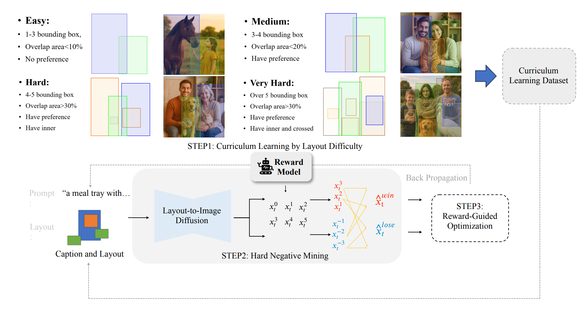
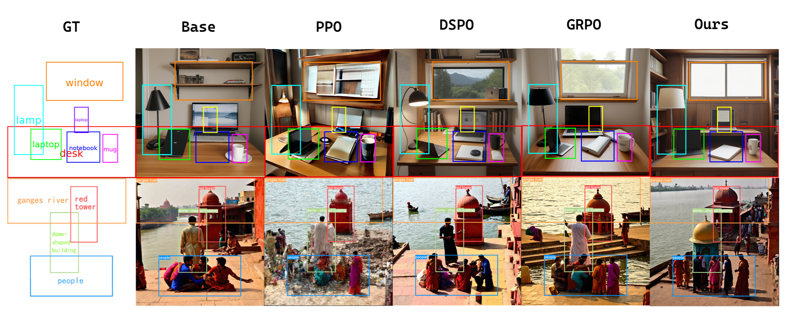
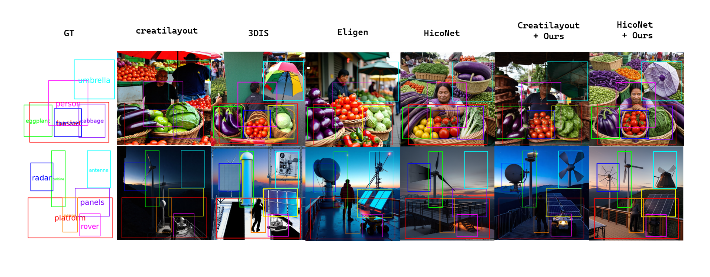

# [ICLR26 Workshop] RLLay: Reinforce Your Layouts — Online RL Fine-tuning for Layout-to-Image Diffusion Models

[](https://openreview.net/forum?id=awfx7eNf5D&referrer=%5BAuthor%20Console%5D(%2Fgroup%3Fid%3DICLR.cc%2F2026%2FWorkshop%2FMM_Intelligence%2FAuthors%23your-submissions))
[](https://www.python.org/downloads/)
[](http://www.apache.org/licenses/LICENSE-2.0)

**RLLay (Reinforce Your Layouts)** is an online reinforcement learning framework for layout-to-image generation that directly fine-tunes diffusion models to improve consistency between generated images and user-specified layouts. Instead of relying on indirect side guidance, RLLay samples multiple candidates per (prompt, layout), ranks them with an IoU-based layout reward computed from detected boxes (e.g., via GroundingDINO), and forms extreme preference pairs (hard negatives) to strengthen the training signal. We further introduce **ARPO**, a pairwise preference optimization method that uses explicit trajectory log-probabilities to stabilize online learning. Combined with a curriculum from easy to hard layouts, RLLay improves spatial layout fidelity while maintaining semantic alignment and image quality across SD1.5- and SD3-based backbones.

<p align="center">
  
</p>

------

## What’s Included 

- **Reward Service (3 reward types):** A lightweight HTTP service for scoring layout-to-image generations, including an IoU-based layout alignment reward (via GroundingDINO) and two additional reward variants exposed under the same service interface for training/evaluation.
- **Training Pipelines (two backbones):** End-to-end RL fine-tuning for **HiCo (SD1.5-based)** and **CreatiLayout (SD3-based)** layout-to-image backbones. For **CreatiLayout**, we provide both **ARPO** and **GRPO** training recipes, along with ready-to-run launcher scripts.
- **Evaluation & Utilities:** LoRA-based evaluation scripts for SD3/SD1.5 variants, prompt/layout JSON loaders and preprocessing utilities, optional visualization helpers, and log-probability–enabled diffusion sampling components used by the ARPO/GRPO pipelines.

------

## Quick Start

### Setup

1. **Environment setup**
```bash
conda create -n rllay python=3.10 -y
conda activate rllay
conda install pytorch==2.4.1 torchvision==0.19.1 torchaudio==2.4.1 pytorch-cuda=12.1 -c pytorch -c nvidia
```
2. **Requirements installation**
```bash
pip install -r requirements.txt
```
### Usage example

The workflow has two steps: (1) start the reward service, then (2) launch training.

1. **Start the reward service**
```bash
bash run_server.sh
```

2. **Run SD3 + ARPO training (RLLay)**
```bash
bash run_sd3_arpo_training.sh
```
or

3. **Run SD15 + ARPO training (RLLay)**
```bash
bash run_sd15_arpo_training.sh
```
Before running, update any path_to_* placeholders in the scripts/configs (e.g., HF_HOME, HF_TOKEN, prompts_json, output_dir, checkpoints).

------

## Comparisons

### ARPO vs. related RL-style objectives
We compare **ARPO** with closely related RL / preference-optimization objectives under the same reward and backbone settings.  
<p align="center">
  
</p>

### RLLay-trained backbones vs. other backbones
We compare **RLLay-trained backbones** against other backbone/model variants on layout fidelity and overall generation quality.  
<p align="center">
  
</p>

------

## Citation

If you find this repository useful, please cite our OpenReview paper:

```bibtex

```

------
## License
This project is released under the Apache License 2.0. See the LICENSE file for details.
